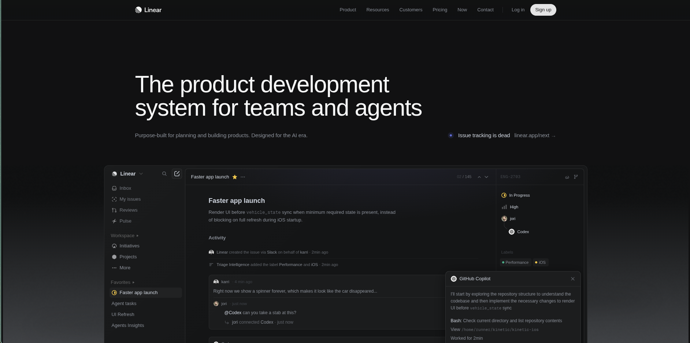

# linear-clone

Pixel-perfect clone of [linear.app](https://linear.app) — the product development system for modern engineering teams. Built with Next.js 16 and Tailwind CSS.

Live demo: [linear.yonasaddisu.me](https://linear.yonasaddisu.me)



## What's cloned

The full marketing homepage of Linear, including:

- Hero section with animated app UI mockup
- Logo marquee (Vercel, OpenAI, Cursor, Ramp, etc.)
- Feature sections — Intake, Plan, Build, Diffs, Monitor, Changelog
- Customer quotes
- Footer

## Stack

- [Next.js 16](https://nextjs.org) (App Router)
- [Tailwind CSS v4](https://tailwindcss.com)
- TypeScript

## Run locally

```bash
npm install
npm run dev
```

Open [http://localhost:3000](http://localhost:3000).

## Related

- [linear.app](https://linear.app) — the real thing
- [github.com/yonasaddisu/linear-clone](https://github.com/yonasaddisu/linear-clone) — this repo
